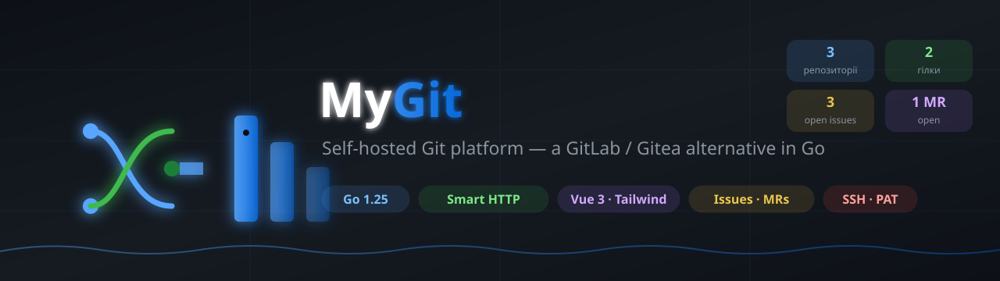
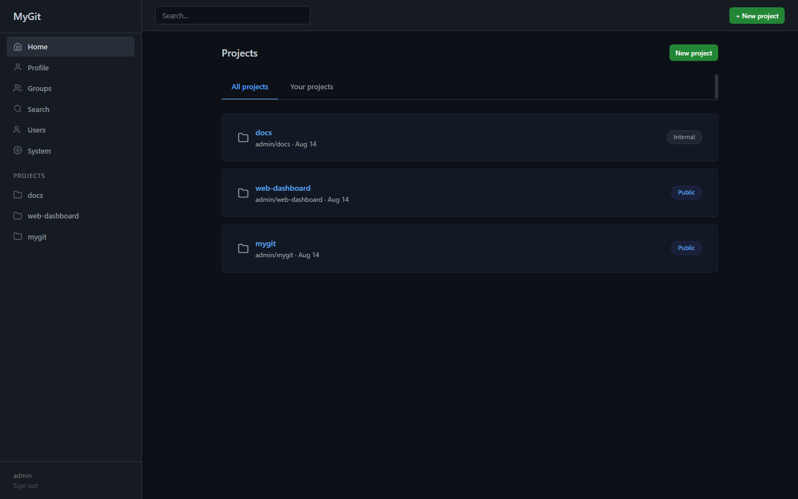
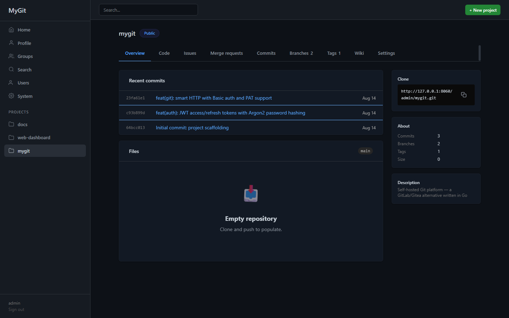
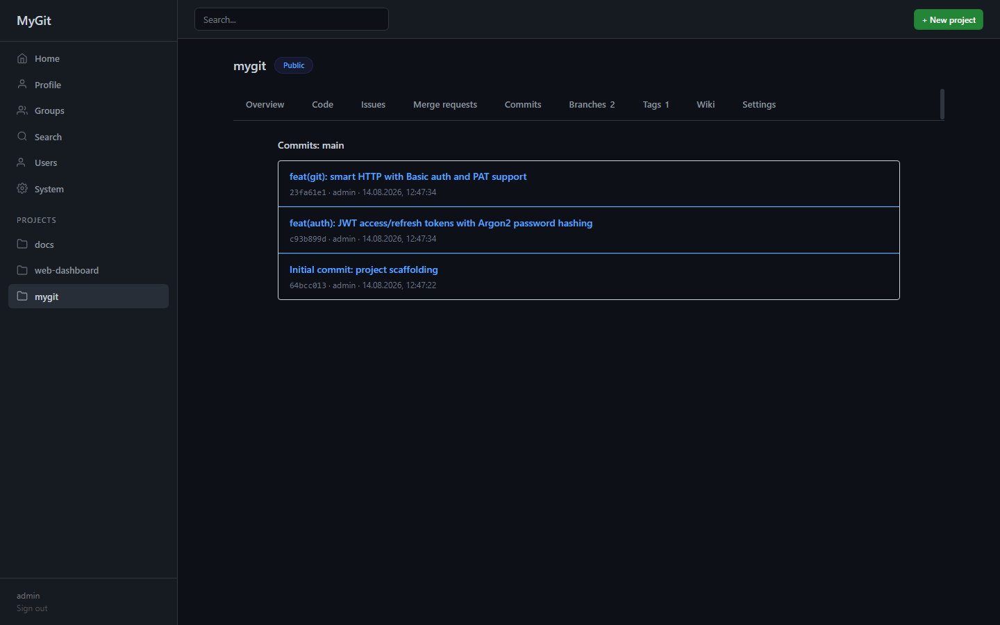
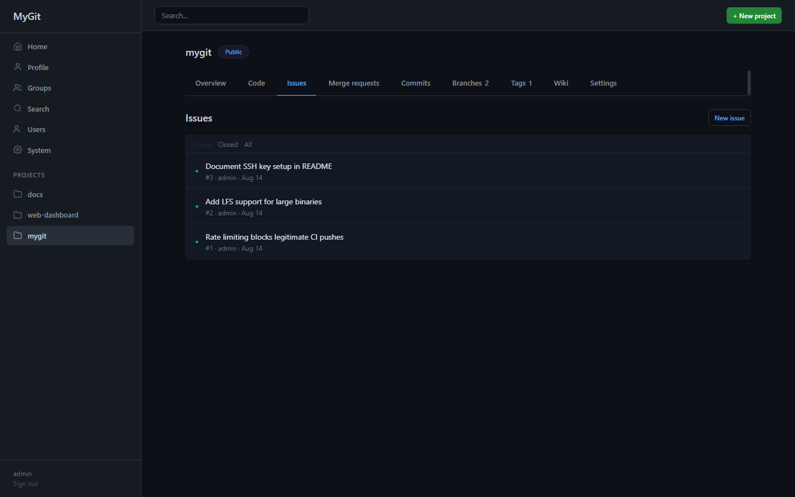
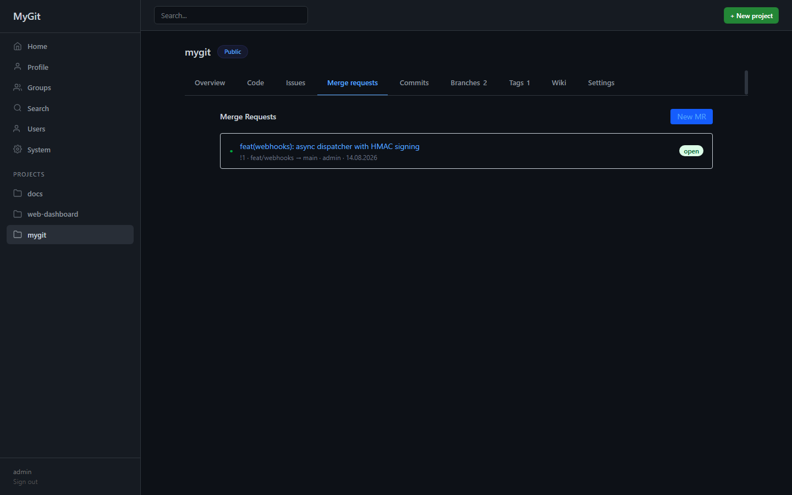
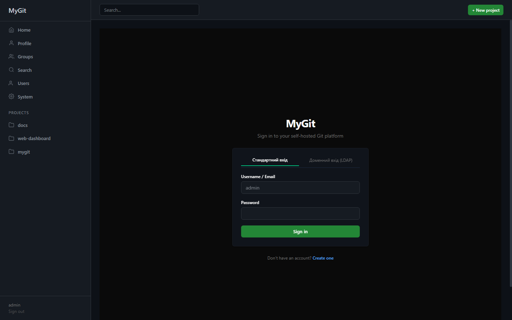

<div align="center">

# MyGit — Source Code

[](https://github.com/ajjs1ajjs/MyGit)
[](https://ajjs1ajjs.github.io/MyGit/)
[](LICENSE)
[](https://github.com/ajjs1ajjs/MyGit/actions/workflows/ci.yml)

> **Це репозиторій з вихідним кодом MyGit self-hosted Git platform.**
> Готовий продукт деплоїться в: **https://github.com/ajjs1ajjs/MyGit**
> Офіційний сайт: **https://ajjs1ajjs.github.io/MyGit/**

# 🐙 MyGit

### A self-hosted Git platform for teams that own their infrastructure

**Self-hosted Git platform** — альтернатива GitLab/Gitea, переписана на Go.



[](https://go.dev)
[](LICENSE)
[](CHANGELOG.md)
[]()
[]()

</div>
---

## 🖼️ Screenshots

<p align="center">
  
  
  
  
</p>

<p align="center">
  
  
</p>

---

## ✨ Можливості

- **Git smart HTTP** — clone/push/pull через стандартний протокол (Basic auth: логін/пароль або PAT)
- **Репозиторії**: створення, fork, видалення; bare-репо на диску `repos/{owner}/{name}.git`
- **Перегляд коду**: дерево файлів, blob, raw, blame, коміти, гілки, теги
- **Issues**: створення, коментарі, стани
- **Merge Requests**: створення, merge
- **Webhooks**: CRUD
- **Користувачі**: реєстрація, JWT, SSH-ключі, Personal Access Tokens
- **Права**: superuser / рольові (owner 50, maintainer 40, developer 30, reporter 20, guest 10)
- **SPA-фронтенд**: Vue 3 + Tailwind (embedded через `go:embed`)
- **SSH git**: AuthorizedKeysCommand + internal API (Linux, через системний OpenSSH)
- **Платформа**: Linux (amd64/arm64) та Windows (amd64/arm64) — статичні бінарники

---

## 🚀 Швидкий старт

**Ubuntu / Debian** (одна команда і встановлює, і оновлює):
```bash
curl -sSL https://raw.githubusercontent.com/ajjs1ajjs/MyGit/main/install.sh | sudo bash
```

**Windows 10/11 / Server 2016+** (PowerShell, від імені Administrator; та ж команда встановлює і оновлює):
```powershell
irm https://raw.githubusercontent.com/ajjs1ajjs/MyGit/main/install.ps1 | iex
```
Потрібен встановлений Git for Windows (`winget install Git.Git`) — MyGit викликає системний `git` для smart HTTP. Інсталятор реєструє MyGit як Windows Service (`mygit`, автозапуск, авто-перезапуск при збої), дані зберігаються в `%ProgramData%\mygit`, бінарник — у `%ProgramFiles%\mygit`.

> **Обмеження:** git-over-HTTP(S) працює повністю на обох платформах. **SSH-git** (`AuthorizedKeysCommand`) залежить від системного OpenSSH-сервера з підтримкою `AuthorizedKeysCommand`, який на Linux (Ubuntu/Debian, `openssh-server`) налаштовується типово. На Windows Win32-OpenSSH теоретично підтримує `AuthorizedKeysCommand`, але це не входить у стандартний `install.ps1` і потребує додаткового ручного налаштування `sshd_config` — тому SSH-git на Windows наразі **не підтримується "з коробки"**; використовуйте git-over-HTTP(S).

Після запуску відкрийте `http://<IP>:8060/` та **зареєструйте перший обліковий запис** — він стане власником (superuser).

### Git push/pull

```bash
git clone http://<IP>:8060/alice/myrepo.git
cd myrepo
git add . && git commit -m "first"
git push origin main   # попросить логін/пароль або PAT
```

Для PAT: Профіль → Tokens → створити; використовуйте як пароль.

---

## ⚙️ Змінні середовища

| Змінна | Призначення | Дефолт |
|--------|-------------|--------|
| `MYGIT_BASE_DIR` | Базова директорія | поточна |
| `MYGIT_REPOS_ROOT` | Директорія bare-репозиторіїв | `{base}/repos` |
| `MYGIT_DB_PATH` | Шлях до SQLite | `{base}/mygit.db` |
| `MYGIT_JWT_SECRET` | Секрет JWT (авто-генерація поруч із БД) | авто |
| `MYGIT_INTERNAL_API_TOKEN` | Токен для git hooks/CI | авто (друкується лише в TTY) |
| `MYGIT_GIT_BINARY` | Шлях до git | `git` |
| `MYGIT_TLS_CERT` | Шлях до TLS-сертифіката (вмикає HTTPS) | порожньо |
| `MYGIT_TLS_KEY` | Шлях до TLS-ключа | порожньо |
| `MYGIT_BACKUP_KEY` | Ключ шифрування архівів беккапів (AES-256-GCM) | похідний від JWT secret |
| `MYGIT_BACKUP_UPLOAD_URL` | Базова URL для upload архівів (HTTP PUT / S3-style) | порожньо |
| `MYGIT_TRUST_PROXY` | Довіряти `X-Forwarded-For` для rate limiting (`1`/`true`) | `0` |

> **HTTPS:** якщо задано `MYGIT_TLS_CERT` і `MYGIT_TLS_KEY`, сервер слухає HTTPS самостійно.
> Інакше (рекомендовано) розмістіть MyGit за reverse-proxy (Caddy/Nginx) із TLS-termination.
> У режимі cookie-авторизації `Secure`-прапорець увімкнеться автоматично лише при HTTPS.

> **Беккапи:** увімкнені розклади (`enabled`) виконуються автоматично фоновими планувальником.
> Частота: `daily` / `hourly` / `weekly` + `time_of_day` (`HH:MM[:SS]`). `encrypt` шифрує архів
> (AES-256-GCM), `upload` відправляє його на `MYGIT_BACKUP_UPLOAD_URL` (PUT, підтримує
> `{filename}` або presigned S3 URL), `keep_local` лишає лише останні N архівів.

> **Авторизація:** SPA використовує **HttpOnly cookies** (`SameSite=Strict`), токени не зберігаються
> у `localStorage`. Програмні клієнти (hooks/CI/CLI) можуть і надалі передавати JWT/PAT через
> `Authorization: Bearer` або Basic auth.

## 📱 PWA

SPA-фронтенд MyGit — це **Progressive Web App** (`vite-plugin-pwa`): встановлюється на телефон/ПК як окремий застосунок і кешує assets через Service Worker. Для цього відкрийте `http://<IP>:8060/` у браузері та оберіть "Встановити додаток".

---

## 🧩 Технології

**Бекенд:** Go 1.25 · net/http · chi · SQLite (WAL, modernc.org/sqlite) · golang-jwt · git subprocess (smart HTTP)
**Фронтенд:** Vue 3 · TypeScript · Vite · Tailwind (embedded)
